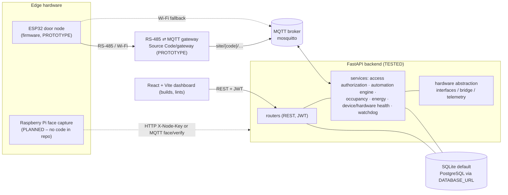

# AIU Smart Campus — System Architecture

*Reconstructed from the code, configuration and tests on 2026-10-09. Every component carries a maturity label (see the legend). Nothing here claims behaviour that was not found in the repository.*

**Maturity legend**
`TESTED` implemented and covered by automated tests that were run · `IMPLEMENTED` code present, not covered by a run test · `PROTOTYPE` code/design present, not demonstrated end to end · `SIMULATED` produces labelled demo data · `PLANNED` described in documents only.

## 1. Component map

## 2. Components and responsibilities

| Component | Location | Responsibility | Maturity |
|---|---|---|---|
| Backend API | `Source Code/backend/app` | REST API, auth/RBAC, access decisions, audit trail, automation, occupancy, energy, health | TESTED (595 passing tests on 2026-10-09) |
| Database | SQLAlchemy models; `Base.metadata.create_all` at start-up plus `migrate_*.py` scripts | Persistence of users, doors, zones, devices, events, readings, audit | TESTED (schema create + idempotent migrations on a temp DB) |
| Dashboard | `Source Code/dashboard` | Admin / doctor / instructor UI | Lint (0 errors, 14 warnings) and production build verified; browser flows not re-verified in this audit |
| Gateway | `Source Code/gateway` (extracted from the phase-6 snapshot) | Relay RS-485 node traffic to MQTT `site/{code}/…` | PROTOTYPE (compiles; no broker/hardware run in this audit) |
| Door-node firmware | `Source Code/door_node_firmware` | ESP32 reader, lock control, MQTT/RS-485 | PROTOTYPE (not compiled here: PlatformIO unavailable) |
| Face ID | `app/routers/face.py`, `app/services/face_service.py` | Encrypted templates, verification, authoritative grant/deny. Embedding provider default `none` ⇒ enrollment capture reports UNAVAILABLE | IMPLEMENTED backend; edge capture PLANNED |
| Occupancy | `app/routers/occupancy.py`, `occupancy_service.py` | Anonymous people-count ingest; source REAL or SIMULATED | TESTED; counts only, no identification |
| Automation | `app/services/automation_engine.py` | Rule evaluation with a verification window and decision log; commands go through the hardware abstraction | TESTED |
| Energy | `energy_service.py`, `energy_timeseries_service.py`, `Energy Impact Study/` | Simulated current readings, energy-waste leads, offline study model | SIMULATED (no current-sensor hardware) |

## 3. Communication paths

- **Dashboard → backend:** REST over HTTP with a JWT bearer token. API base URL is derived at runtime from the dashboard's host (port 8000) unless `VITE_API_BASE_URL` is set.
- **Door node ⇄ backend:** MQTT topics `site/{code}/status|event|alert` (node→backend) and `site/{code}/cmd` (backend→node). `…/ac|light|plug/…` carry room devices and `…/occupancy/status` a boolean presence flag.
- **Newer hierarchy:** `university/{uid}/building/{bid}/zone/{zid}/…` for sensor telemetry and device commands. Messages for unknown zones/malformed topics are logged and ignored.
- **Face verification:** MQTT `…/face/verify` and `…/face/ack`, or HTTP node endpoints guarded by `X-Node-Key` (disabled with 403 while `FACE_NODE_API_KEY` is empty).
- **Gateway:** subscribes to `site/{code}/cmd` per configured node and republishes node reports onto the same topics the backend subscribes to (verified by reading both sides; not run against a broker in this audit).

## 4. Authentication and authorization

JWT (HS256) with bcrypt password hashes; role-based access (admin, doctor, instructor) plus operational/organizational scope; login attempts are rate-limited and lock out; credential data (card UIDs) is Fernet-encrypted with an HMAC blind index. Access decisions are authoritative in the backend, with a WHO/WHEN schedule or temporary-window check recorded as an access event.

## 5. Error handling and degraded operation

`DISABLE_MQTT=true` runs the API without a broker (used by tests). A staleness watchdog marks silent doors offline. Unknown door codes, malformed topics and bad payloads are logged and dropped, not fatal. Missing sensor data is `None`/UNAVAILABLE rather than a false reading. Face failures can never convert into a grant.

## 6. Simulation versus real hardware

Occupancy and energy readings in the demo are SIMULATED and labelled so. The occupancy/energy simulators exist because no current-sensor hardware is installed. Hardware command interfaces (`app/hardware/interfaces.py`) are abstract; the concrete bridges only publish MQTT. No physical door, Raspberry Pi or camera operation was exercised in this audit.

## 7. Known integration gaps

1. No Raspberry Pi code exists in the repository; only the backend side of Face ID.
2. Firmware and gateway were not run together against the backend; compatibility is documented, not demonstrated.
3. Schema changes are applied by ad-hoc `migrate_*.py` scripts (hard-coded to `./access_control.db`) instead of a migration framework.
4. Attendance (per-student presence) is **not** implemented anywhere; the indoor attendance camera in the graduation film is a concept visualisation.
