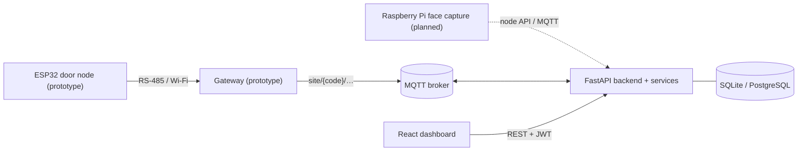

# AIU Smart Campus — Cyber-Physical Campus Management System

Graduation project, **Alamein International University (AIU)**. A smart-campus platform combining secure door access and authorization, room occupancy counting, smart-building automation and energy monitoring: ESP32 door nodes with RFID/DESFire, an RS-485/Wi-Fi gateway, a FastAPI backend, MQTT messaging and a React admin dashboard.


> **Honest status:** the backend and dashboard are tested software. Door-node firmware, the gateway, Face ID at the door and the Raspberry Pi edge device are **prototype/planned** and were not demonstrated end to end. Occupancy and energy data in demos are **simulated and labelled**. Per-student attendance is **not implemented**. See [Known limitations](#known-limitations).

## Contents
[Capabilities](#verified-platform-capabilities) · [Architecture](#architecture) · [Tech stack](#technology-stack) · [Structure](#repository-structure) · [Install & run](#installation-and-startup) · [Configuration](#configuration) · [Database](#database) · [Testing](#testing) · [API](#api-documentation) · [Hardware & MQTT](#hardware-integration-and-mqtt) · [Simulation](#simulation-mode) · [Energy](#energy-monitoring) · [Security](#security-and-privacy) · [Troubleshooting](#troubleshooting) · [Limitations](#known-limitations) · [Docs](#documentation-index) · [Film](#graduation-trailer) · [Archive](#archive) · [Credits](#author-and-credits)

## Verified platform capabilities

Verified = covered by backend automated tests that were run (595 passing on 2026-10-09; see the [audit report](./Reports%20and%20Audits/REPOSITORY_AUDIT_2026-10-09.md)).

- **Access & authorization:** scheduled/temporary access windows, WHO/WHEN authorization check, persisted access events with investigation detail, emergency overrides, anomaly indicators.
- **Accounts & RBAC:** admin / doctor / instructor roles with organizational and operational scope, forced password change, password reset, lockout after repeated failures, audit log.
- **Smart Building:** buildings, rooms, zones, sensors and devices; automation engine with a verification window and decision log; HVAC model; hardware-node health; staleness watchdog.
- **Occupancy:** anonymous people-count ingest (`REAL` or `SIMULATED`). Counts people only — it does not identify anyone.
- **Academic administration:** colleges, departments, courses, doctors and teaching assistants, Excel import.
- **Dashboard:** command hub, global search, command palette, role-based sidebar (builds and lints; browser flows not re-verified in the latest audit).

## Architecture

Full document with maturity labels: [`Documents/ARCHITECTURE.md`](./Documents/ARCHITECTURE.md).



## Technology stack

| Layer | Technology |
|---|---|
| Backend | Python 3.10+, FastAPI, SQLAlchemy 2, Pydantic 2, python-jose (JWT), bcrypt, paho-mqtt, openpyxl |
| Database | SQLite by default; PostgreSQL via `DATABASE_URL` |
| Dashboard | React 19, Vite 8, oxlint |
| Firmware | ESP32, PlatformIO / C++ (`Source Code/door_node_firmware`) |
| Gateway | Python, pyserial, PyYAML, paho-mqtt (`Source Code/gateway`) |
| Messaging | MQTT (mosquitto) |

## Repository structure

```
GRADUATION PROJECT/
├─ README.md
├─ start.sh / start_lan.sh      Start mosquitto + backend + dashboard (needs the backend venv, see below)
├─ Source Code/
│  ├─ backend/                  FastAPI app: app/routers, app/services, app/hardware, tests/, scripts/, migrate_*.py
│  ├─ dashboard/                React + Vite admin dashboard
│  ├─ door_node_firmware/       ESP32 firmware (PlatformIO)
│  ├─ gateway/                  RS-485 ⇄ MQTT gateway (from the phase-6 snapshot)
│  └─ Archive (phase snapshots)/  Original zipped phase snapshots — preserved
├─ Documents/                   ARCHITECTURE.md, design document, proposal, phase guides, import templates
├─ Reports and Audits/          Phase 9–11 reports (historical) and the 2026-10-09 repository audit
├─ Hardware/                    Bill of materials, integration guide, readiness checklist
├─ Energy Impact Study/         model.py, report (docx/pdf), presentation, charts
└─ Trailer and Media/           Graduation-film scripts, reports and tooling (large media is not stored in git)
```

## Installation and startup

Full, verified step-by-step guide (backend, dashboard, MQTT, gateway, firmware, troubleshooting): **[`Documents/SETUP.md`](./Documents/SETUP.md)**. Quick version:

Requirements: Python 3.10+, Node.js 18+ (22 tested), optionally `mosquitto`.

```bash
git clone https://github.com/AmrMhmd007/GRADUATION-PROJECT.git
cd GRADUATION-PROJECT

# 1. Backend (one-time) — start.sh expects Source Code/backend/venv
cd "Source Code/backend"
python3 -m venv venv && source venv/bin/activate
pip install -r requirements.txt
cp .env.example .env            # then edit values (see Configuration)
python -m scripts.seed_db       # creates tables + a sample admin account
deactivate && cd ../..

# 2. Dashboard (one-time)
cd "Source Code/dashboard" && npm install && cp .env.example .env && cd ../..

# 3. Run everything
./start.sh                      # backend :8000 + dashboard :5173 (mosquitto if installed)
./start_lan.sh                  # same, reachable from other devices on the network
```

Open `http://localhost:5173` and sign in with the admin created by `seed_db.py`. Manual alternative: `uvicorn app.main:app --reload` in `Source Code/backend` and `npm run dev` in `Source Code/dashboard`.

> `start.sh` stops whatever process is already listening on port 8000 before starting the backend.

## Configuration

Copy `Source Code/backend/.env.example` to `.env` (git-ignored). Key variables: `DATABASE_URL`, `JWT_SECRET`, `JWT_EXPIRE_MINUTES`, `MQTT_BROKER_HOST/PORT/USE_TLS/USERNAME/PASSWORD`, `DISABLE_MQTT`, `ALLOWED_ORIGINS` (CORS; `*` is for local development only), `CREDENTIAL_ENCRYPTION_KEY` and `CREDENTIAL_INDEX_KEY` (must be persisted), `FACE_NODE_API_KEY`, `FACE_EMBEDDING_PROVIDER`. The backend logs a warning at start-up for insecure defaults (never printing secret values). Firmware secrets live in `door_node_firmware/include/secrets.h` (git-ignored; template: `secrets_example.h`). The dashboard needs `VITE_API_BASE_URL` only for a non-default backend host.

## Database

SQLAlchemy models create their tables at start-up (`Base.metadata.create_all`). For databases created by older versions, run the idempotent `migrate_*.py` scripts from `Source Code/backend` — they currently operate on `./access_control.db` only (see limitations). Back up the database before migrating. `.db` files are git-ignored.

## Testing

```bash
cd "Source Code/backend" && source venv/bin/activate
DISABLE_MQTT=true pytest -q         # tests use their own SQLite file; run serially (not with xdist)
cd ../dashboard && npm run lint && npm run build
```

Latest run (2026-10-09, isolated copy, Python 3.10, Node 22): backend 595 + 5 new config tests passing; lint 0 errors / 14 warnings; production build succeeds. Firmware compilation and live hardware/MQTT tests were **not** run.

## API documentation

With the backend running: interactive docs at `http://localhost:8000/docs` (Swagger UI) and `/redoc`. Routers live in `Source Code/backend/app/routers/`.

## Hardware integration and MQTT

Details: [`Hardware/HARDWARE_INTEGRATION.md`](./Hardware/HARDWARE_INTEGRATION.md), [`Hardware/HARDWARE_BOM.md`](./Hardware/HARDWARE_BOM.md), [`Hardware/HARDWARE_READINESS_CHECKLIST.md`](./Hardware/HARDWARE_READINESS_CHECKLIST.md).

| Topic | Direction | Payload |
|---|---|---|
| `site/{code}/status` | node → backend | `"online"` / `"offline"` |
| `site/{code}/event`, `site/{code}/alert` | node → backend | JSON access event / alert |
| `site/{code}/cmd` | backend → node | `{"cmd": "lock"\|"unlock"}` |
| `site/{code}/ac\|light\|plug/…` | both | room devices |
| `site/{code}/occupancy/status` | node → backend | `{"occupied": bool}` |
| `university/{uid}/building/{bid}/zone/{zid}/…` | both | sensor telemetry / device commands |
| `…/face/verify`, `…/face/ack` | node ⇄ backend | face verification handshake |

The gateway and backend agree on these topics by code inspection; they were not run together in the latest audit.

## Simulation mode

Occupancy rows carry a source (`REAL` or `SIMULATED`) and the UI labels simulated data. Energy current readings are simulated (no current sensors installed). Demo databases and recordings are kept out of git.

## Energy monitoring

Runtime: energy readings, waste leads and HVAC modelling in the backend (simulated inputs). Offline analysis: [`Energy Impact Study/`](./Energy%20Impact%20Study/) (model, report, presentation).

## Security and privacy

JWT authentication, bcrypt hashing, RBAC with scope enforcement, login lockout, encrypted credential storage, audit logging; secrets are read from the environment and `.env`/`secrets.h`/databases are git-ignored. Occupancy is anonymous counting; face templates are encrypted and never shown; the face embedding provider defaults to `none`. **Before any shared deployment:** set a strong `JWT_SECRET`, persist the encryption keys, restrict `ALLOWED_ORIGINS`, enable MQTT authentication/TLS, and use HTTPS. This repository has not had an external penetration test.

## Troubleshooting

- *`start.sh` fails at `source venv/bin/activate`* — create the backend venv first (Installation step 1).
- *Backend runs but MQTT errors repeat* — start mosquitto or set `DISABLE_MQTT=true`.
- *Dashboard cannot reach the API* — check the backend is on port 8000 and `ALLOWED_ORIGINS` includes the dashboard origin; set `VITE_API_BASE_URL` for a different host.
- *Encrypted credentials unreadable after restart* — `CREDENTIAL_ENCRYPTION_KEY` was not persisted.
- *Port 8000 busy* — `start.sh` frees it; otherwise choose another port with uvicorn `--port`.

## Known limitations

1. No Raspberry Pi code exists here; only the backend side of Face ID. The embedding provider is `none` by default.
2. Firmware and gateway are prototypes; not compiled/run together in the latest audit. The gateway README references `rs485_protocol.h` and `test_cross_lang.py`, which are missing from `door_node_firmware/`.
3. No per-student attendance anywhere in the system.
4. Migrations are ad-hoc scripts bound to `./access_control.db`; there is no migration framework.
5. Dashboard `package.json` lists a macOS-specific optional dependency (`@rolldown/binding-darwin-arm64`).
6. `ALLOWED_ORIGINS` defaults to `*` for convenience.

Full prioritised backlog: [`Reports and Audits/REPOSITORY_AUDIT_2026-10-09.md`](./Reports%20and%20Audits/REPOSITORY_AUDIT_2026-10-09.md).

## Documentation index

- [Manual setup guide](./Documents/SETUP.md) · [Architecture](./Documents/ARCHITECTURE.md) · [System Design Document](./Documents/System_Design_Document.docx) · [Proposal](./Documents/Access_Control_System_Proposal_Revised.docx) · [Project timeline](./Documents/Access_Control_System_Project_Timeline.xlsx)
- [Security Review (phase 5)](./Documents/Phase5_Security_Review.pdf) · [Multi-node deployment guide](./Documents/Phase6_Multi_Node_Deployment_Guide.pdf) · [System test report (phase 7)](./Documents/Phase7_System_Test_Report.pdf) · [Wiring & bench test](./Documents/Phase2_Wiring_and_Bench_Test_Guide.docx) · [Study guide](./Documents/Study_Guide_Access_Control_Project.pdf)
- Import templates: `Documents/door_import_template.xlsx`, `Documents/staff_import_template.xlsx`

### Reports and audits (historical unless dated otherwise)
[Cyber-physical upgrade notes](./Reports%20and%20Audits/CYBER_PHYSICAL_UPGRADE.md) · [Phase 9 frontend/API audit](./Reports%20and%20Audits/PHASE_9_FRONTEND_API_AUDIT.md) · [Phase 10 final system audit](./Reports%20and%20Audits/PHASE_10_FINAL_SYSTEM_AUDIT.md) · [Phase 10.1 smoke-test checklist](./Reports%20and%20Audits/PHASE_10.1_MANUAL_SMOKE_TEST_CHECKLIST.md) · [Phase 11 hardening report](./Reports%20and%20Audits/PHASE_11_PRODUCTION_HARDENING_REPORT.md) · **[Repository audit 2026-10-09](./Reports%20and%20Audits/REPOSITORY_AUDIT_2026-10-09.md)**

## Graduation trailer

`Trailer and Media/AIU_SMART_CAMPUS_FINAL/` holds the production scripts, timeline, reports and tooling for the 115-second bilingual narrated film: Blender concept scenes (labelled), real screen recordings of this dashboard on an isolated demo database, and a supplied voice-over. The indoor attendance camera in the film is a **concept**. Videos, audio, renders, `.blend` files and demo databases are not stored in git. Older trailer material: `Trailer and Media/Earlier Versions/`.

## Archive

`Source Code/Archive (phase snapshots)/` keeps the original zipped phase snapshots (backend phase 7, dashboard phase 4, door-node firmware phase 6, gateway phase 6) unchanged; `Source Code/gateway/` is an extracted copy of the gateway snapshot.

## Author and credits

**Amr Mohamed** — [github.com/AmrMhmd007](https://github.com/AmrMhmd007), Alamein International University. 3D character assets in the film: Quaternius (CC0); see `Trailer and Media/AIU_SMART_CAMPUS_FINAL/assets/ASSET_LICENSES.md`.
